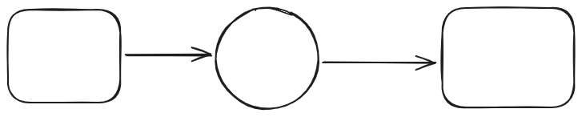

Note: Use Markdown Cheat Sheet download in the directory as needed.

- Useful links
  - https://github.com/im-luka/markdown-cheatsheet

# Progress Report
- Author: Satya Phanindra Kumar Kalaga
- GitHub: [phanindra-max](https://github.com/phanindra-max)
---
## Date: Week 1 - September 09 2025 
- Topics of discussion
    - Understanding RL Framework (MDP)
    - Explore Gymanasium Environments
    - Explore RL Algorithms (Q-Learning, DQN, Policy Gradients)

- Action Items:

* [x] Understand Markov Decision Process (MDP), and sequential decision making
* [x] Understand designing State and Action spaces, Reward functions
* [x] Implement basic algorithms (Simple Heuristic) in CartPole-v1

---

## Date: Week 2 - September 16 2025
- Topics of discussion
    - Literature Review on relevant papers
    - Explore RL algorithms (Q-Learning, DQN, Policy Gradients)

- Action Items:

* [ ] Skim through papers suggested by Tyler and pick one to implement
* [ ] Implement Q-Learning in CartPole-v1
---
## Date: Week 3 - September 23 2025
- Topics of discussion
    - Implement RL Guided SSL paper
    - Setup required files for the project (main.py, model.py, utils/env.py, train.py, test.py, benchmark.py)

- Action Items:

* [ ] Build a simple RL Guided SSL pipeline in a sandbox environment
* [ ] Create the required files in respective directories
---
## Date: Week 4 - Month Day Year 
- Topics of discussion
    - Item1
    - Item2
    - Item3

- Action Items:

* [ ] Action Item 1
* [ ] Action Item 2
* [ ] Action Item 3
* [ ] Action Item 4
* [ ] Action Item 5
---
## Date: Week 5 - Month Day Year 
- Topics of discussion
    - Item1
    - Item2
    - Item3

- Action Items:

* [ ] Action Item 1
* [ ] Action Item 2
* [ ] Action Item 3
* [ ] Action Item 4
* [ ] Action Item 5
---
## Date: Week 6 - Month Day Year 
- Topics of discussion
    - Item1
    - Item2
    - Item3

- Action Items:

* [ ] Action Item 1
* [ ] Action Item 2
* [ ] Action Item 3
* [ ] Action Item 4
* [ ] Action Item 5
---
## Date: Week 7 - Month Day Year 
- Topics of discussion
    - Item1
    - Item2
    - Item3

- Action Items:

* [ ] Action Item 1
* [ ] Action Item 2
* [ ] Action Item 3
* [ ] Action Item 4
* [ ] Action Item 5
----
## Date: Week 8 - Month Day Year 
- Topics of discussion
    - Item1
    - Item2
    - Item3

- Action Items:

* [ ] Action Item 1
* [ ] Action Item 2
* [ ] Action Item 3
* [ ] Action Item 4
* [ ] Action Item 5
---

## Date: Week 9 - Month Day Year 
- Topics of discussion
    - Item1
    - Item2
    - Item3

- Action Items:

* [ ] Action Item 1
* [ ] Action Item 2
* [ ] Action Item 3
* [ ] Action Item 4
* [ ] Action Item 5
---
## Date: Week 10 - Month Day Year 
- Topics of discussion
    - Item1
    - Item2
    - Item3

- Action Items:

* [ ] Action Item 1
* [ ] Action Item 2
* [ ] Action Item 3
* [ ] Action Item 4
* [ ] Action Item 5
---
## Date: Week 11 - Month Day Year 
- Topics of discussion
    - Item1
    - Item2
    - Item3

- Action Items:

* [ ] Action Item 1
* [ ] Action Item 2
* [ ] Action Item 3
* [ ] Action Item 4
* [ ] Action Item 5
---
## Date: Week 12 - Month Day Year 
- Topics of discussion
    - Item1
    - Item2
    - Item3

- Action Items:

* [ ] Action Item 1
* [ ] Action Item 2
* [ ] Action Item 3
* [ ] Action Item 4
* [ ] Action Item 5
---
## Date: Week 13 - Month Day Year 
- Topics of discussion
    - Item1
    - Item2
    - Item3

- Action Items:

* [ ] Action Item 1
* [ ] Action Item 2
* [ ] Action Item 3
* [ ] Action Item 4
* [ ] Action Item 5
---
## Date: Week 14 - Month Day Year 
- Topics of discussion
    - Item1
    - Item2
    - Item3

- Action Items:

* [ ] Action Item 1
* [ ] Action Item 2
* [ ] Action Item 3
* [ ] Action Item 4
* [ ] Action Item 5
---
- **_Add Images and Diagrams Using Excalidraw_**
  - Just draw it and then copy as png paster in the editor



- **_Add Equation_**
  - $e^{\pi i} + 1 = 0$


- **_Add Pyhton Code_**

```
import numpy as np
a = np.array()
```

- **_Add Tables as needed._**

| Checkbox Experiments | checked header | crossed header |
| ---------------------|:--------------:|:--------------:|
| checkbox             |  &check; Row   |  &cross; row   |


- **_Add Tables as needed._**


|checked|unchecked|crossed|
|---|---|---|
|&check;|_|&cross;|
|&#x2611;|&#x2610;|&#x2612;|


- **_Add Tables as needed._**

| Selection |        |
| --------- | ------ |
| &#x2610;  |

| Selection |        |
| --------- | ------ |
| &#x2611; |

- **_Create Links as needed_**
  - [link text](full url minus the en-us locale)

- **_Add Geo Json_**

```geojson
{
  "type": "FeatureCollection",
  "features": [
    {
      "type": "Feature",
      "id": 1,
      "properties": {
        "ID": 0
      },
      "geometry": {
        "type": "Polygon",
        "coordinates": [
          [
              [-90,35],
              [-90,30],
              [-85,30],
              [-85,35],
              [-90,35]
          ]
        ]
      }
    }
  ]
}
```

- **_Add flow chart_**


