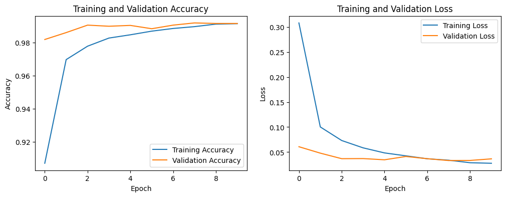
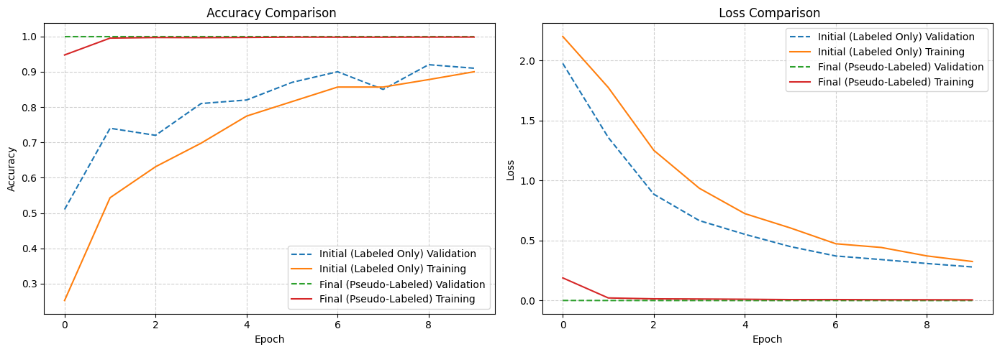
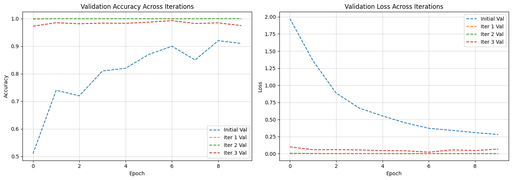
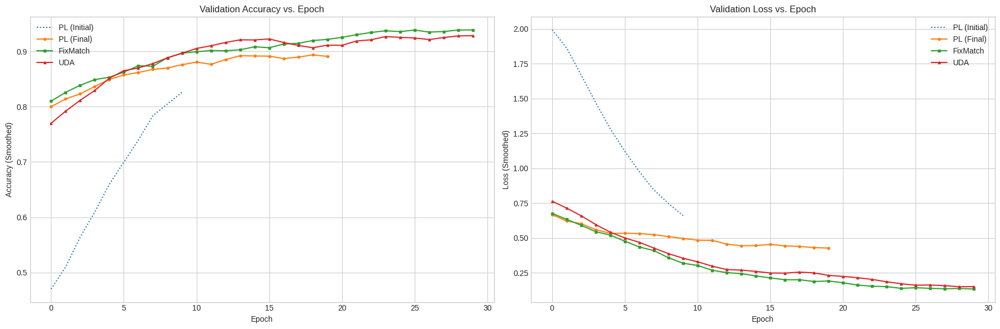

# Semi-Supervised Learning Experiments on MNIST

These experiments explores and compares several semi-supervised learning (SSL) techniques (Outlined in this [paper](https://arxiv.org/pdf/2408.07221)) for image classification on the MNIST dataset. The goal is to evaluate how effectively these methods can leverage a large amount of unlabeled data to improve performance when only a small fraction of labeled data is available.

The experiments include:

- A standard supervised baseline trained on the full dataset.
- A simple, single-shot Pseudo-Labeling approach.
- An iterative version of Pseudo-Labeling.
- A direct comparison between Pseudo-Labeling, FixMatch, and Unsupervised Data Augmentation (UDA).

## Project Structure

The codebase is organized into utility modules and individual, runnable experiment scripts.

```
.
├── mnist_training_utils.py     # Core helper functions (data loading, plotting, model building)
├── ssl_models.py               # Keras Model classes for SSL algorithms (PL, FixMatch, UDA)
|
├── train_standard_cnn_mnist.py # Experiment 1: Supervised baseline
├── pseudo_labeling_mnist.py    # Experiment 2: Single-shot Pseudo-Labeling
├── iterative_pseudo_labeling.py# Experiment 3: Iterative Pseudo-Labeling
└── compare_ssl_methods.py      # Experiment 4: Comparison of SSL methods
```

## Setup and Installation

To set up the project, follow these steps to clone the repository, create a virtual environment, and install the required dependencies.

1. **Clone the repository** to your local machine:
   ```bash
   git clone https://github.com/phanindra-max/fall-2025-group11.git
   cd src/component/
   ```

2. **Create and activate a virtual environment**:
   ```bash
   # On Windows
   python -m venv venv
   .\venv\Scripts\activate

   # On macOS/Linux
   python3 -m venv venv
   source venv/bin/activate
   ```

3. **Install the required dependencies**:
   ```bash
   pip install tensorflow numpy matplotlib scikit-learn
   ```

## How to Run Experiments

Each experiment can be run independently from the command line.

```bash
# To run the standard supervised baseline
python train_standard_cnn_mnist.py

# To run the single-shot pseudo-labeling experiment
python pseudo_labeling_mnist.py

# To run the iterative pseudo-labeling experiment
python iterative_pseudo_labeling.py

# To run the comparison of all SSL methods
python compare_ssl_methods.py
```

## Experiments and Results

### Experiment 1: Standard Supervised Training (Baseline)

This script trains a standard CNN on the full 60,000 labeled MNIST training images. This serves as the upper-bound performance benchmark for our model architecture.

**Final Test Accuracy:** 99.24%



### Experiment 2: Single-Shot Pseudo-Labeling

This experiment simulates a scenario with limited labeled data. It first trains a model on only 1,000 labeled samples, then uses this model to generate "pseudo-labels" for unlabeled data it is confident about. Finally, a new model is trained on the combined labeled and pseudo-labeled data.

**Initial Model Accuracy (1,000 labels):** 92.86%  
**Final Model Accuracy (after adding 34,799 pseudo-labels):** 95.00%

This shows a significant performance gain of +2.14% from a single round of pseudo-labeling. The final model's training is much more stable, as seen in the graph.



### Experiment 3: Iterative Pseudo-Labeling

This approach extends the single-shot method by iteratively generating pseudo-labels and adding them to the training set over several rounds. Each iteration trains a new model on an increasingly larger dataset.

**Initial Accuracy:** 92.86%  
**After Iteration 1:** 94.98%  
**After Iteration 2:** 96.45%  
**After Iteration 3:** 96.42%

The iterative process provides a substantial boost in accuracy, reaching a peak of 96.45%. The slight dip in the final iteration suggests that noisy pseudo-labels may be starting to accumulate.



### Experiment 4: Comparison of SSL Methods

This script provides a fair comparison between three SSL techniques using the same 1,000 labeled samples and validation set.

- **Pseudo-Labeling (PL):** A simple, multi-stage approach.
- **FixMatch:** An advanced method that uses consistency regularization between weakly and strongly augmented versions of an unlabeled image.
- **Unsupervised Data Augmentation (UDA):** Another consistency regularization method that aims to minimize the divergence between predictions on an original and an augmented image.



**Final Test Accuracies:**

| Method          | Initial Accuracy | Final Accuracy |
|-----------------|------------------|----------------|
| Pseudo-Labeling | 93.75%           | 94.55%         |
| FixMatch        | -                | 96.91%         |
| UDA             | -                | 97.16%         |

The more advanced consistency-based methods, UDA and FixMatch, significantly outperform the simpler Pseudo-Labeling approach.

## Conclusion

The experiments demonstrate the powerful impact of semi-supervised learning techniques. When labeled data is scarce, all SSL methods tested provide a significant improvement over a baseline model trained on only the small labeled set. More sophisticated methods like UDA and FixMatch are particularly effective, nearly closing the gap to the fully supervised baseline.