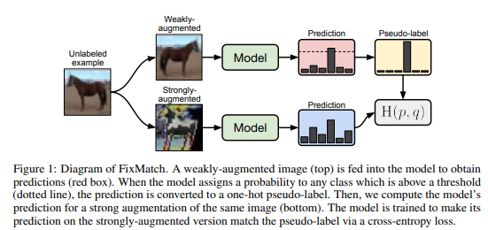

# FixMatch: Simplifying Semi-Supervised Learning with Consistency and Confidence

This branch has the code and summary for the paper "FixMatch: Simplifying Semi-Supervised Learning with Consistency and Confidence". This README covers the core concepts, methodology, and key results from the paper making it easy to understand the algorithm at a high-level. For implementation details check the README in the `./component` folder.

## What is FixMatch?

FixMatch is a semi-supervised learning (SSL) algorithm that significantly simplifies previous state-of-the-art methods while achieving better performance. It's designed to effectively leverage large amounts of unlabeled data alongside a small set of labeled data.

The core idea is a combination of two common SSL techniques: **pseudo-labeling** and **consistency regularization**. FixMatch generates artificial labels for unlabeled data and trains the model to be consistent in its predictions, even when the input data is heavily augmented.

### Understanding the Core Concepts

**Pseudo-Labeling**: A technique where the model generates its own labels for unlabeled data based on its confident predictions, then uses these artificial labels to train itself further.

**Consistency Regularization**: A principle that enforces the model to produce similar predictions for the same input under different augmentations, helping it learn robust features invariant to transformations.

## How It Works: The Core Mechanism

The algorithm operates on a simple principle: predict a pseudo-label for an unlabeled data point using a weak augmentation, and then train the model to predict that same label for a strong augmentation of the same data point.

Here's the step-by-step process for an unlabeled image:

1. **Weak Augmentation**: Apply a simple augmentation (like random flips and shifts) to an unlabeled image.

2. **Generate Pseudo-Label**: Feed the weakly-augmented image to the model to get a prediction. If the model's prediction for any class is above a certain confidence threshold (e.g., 95%), this prediction is converted into a "hard" one-hot pseudo-label. If not, the image is ignored for this training step.

3. **Strong Augmentation**: Apply a much more aggressive augmentation (like RandAugment or CTAugment, which heavily distort the image) to the original unlabeled image.

4. **Train the Model**: Train the model to predict the pseudo-label (from step 2) using the strongly-augmented image (from step 3) as input.

      

      *Figure 1. The FixMatch training process. Source: Sohn et al. (2020).*

This process forces the model to learn representations that are invariant to significant perturbations, which is the essence of consistency regularization. The confidence threshold ensures that the model is only trained on pseudo-labels it is already confident about, preventing error propagation from incorrect guesses.

## Data Augmentation Strategy

The choice of augmentation is crucial to FixMatch's success. The algorithm employs asymmetric augmentation: weak for pseudo-label generation and strong for consistency training.

### Weak Augmentation
The weak augmentation applies minimal transformations to preserve the image's essential characteristics:
- **Horizontal Flip**: Randomly flip images horizontally with 50% probability
- **Translation**: Shift images by up to 12.5% vertically and horizontally

### Strong Augmentation
Strong augmentation applies aggressive transformations to create challenging variants of the input. FixMatch uses three main techniques:

**Cutout**: Randomly masks out square regions of the input image, forcing the model to learn from partial information and improving robustness.

**RandAugment**: A simplified augmentation strategy that randomly applies a sequence of transformations (like rotation, color distortion, contrast changes, sharpness adjustments etc) with uniform sampling. It has only two hyperparameters: the number of transformations to apply and the magnitude of distortions.

**CTAugment (Control Theory Augment)**: An adaptive augmentation strategy that learns which augmentations are most beneficial during training. It uses a control-theoretic approach to adjust augmentation magnitudes based on model performance, ensuring augmentations remain challenging but not so extreme that they harm learning.

## The Loss Function

The total loss in FixMatch is a simple combination of a supervised loss and an unsupervised loss.

**Supervised Loss (l_s)**: This is a standard cross-entropy loss calculated on the labeled data.

$$l_s = \frac{1}{B} \sum_{b=1}^{B} H(p_b, p_m(y|\alpha(x_b)))$$

where $p_b$ is the true label and $\alpha(x_b)$ is a weakly-augmented labeled image.

**Unsupervised Loss (l_u)**: This is the core of FixMatch. It's a cross-entropy loss applied to the strongly-augmented unlabeled data, but only for samples where the model's prediction on the weakly-augmented version exceeded the confidence threshold τ.

$$l_u = \frac{1}{\mu B} \sum_{b=1}^{\mu B} \mathbb{1}(\max(q_b) \geq \tau) H(\hat{q}_b, p_m(y|A(u_b)))$$

where:
- $q_b = p_m(y|\alpha(u_b))$ is the prediction for a weakly-augmented unlabeled image.
- $\hat{q}_b = \arg\max(q_b)$ is the hard pseudo-label.
- $A(u_b)$ is a strongly-augmented version of the same image.

The final loss is simply:

$$\text{Loss} = l_s + \lambda_u l_u$$

## The Algorithm

Here's the core FixMatch algorithm at a high level:

**Algorithm: FixMatch**

**Input**: 
- Labeled batch X = {(x_b, p_b) : b ∈ (1, ..., B)}
- Unlabeled batch U = {u_b : b ∈ (1, ..., μB)}
- Confidence threshold τ
- Unlabeled data ratio μ
- Unlabeled loss weight λ_u

**Steps**:
1. Compute supervised loss on labeled data:
   ```
   l_s = (1/B) Σ(b=1 to B) H(p_b, p_m(y | α(x_b); θ))
   ```
   *Cross-entropy loss for labeled data*

2. For each unlabeled sample b = 1 to μB:
   ```
   q_b = p_m(y | α(u_b); θ)
   ```
   *Compute prediction after applying weak augmentation to u_b*

3. Compute unsupervised loss on unlabeled data:
   ```
   l_u = (1/μB) Σ(b=1 to μB) 𝟙(max(q_b) ≥ τ) H(argmax(q_b), p_m(y | A(u_b); θ))
   ```
   *Cross-entropy loss with pseudo-label and confidence masking for unlabeled data*

4. **Return**: l_s + λ_u × l_u

Where:
- α(·) denotes weak augmentation
- A(·) denotes strong augmentation
- 𝟙(·) is the indicator function (1 if condition is true, 0 otherwise)
- H(·,·) is the cross-entropy loss

## Key Results and Achievements

FixMatch demonstrated state-of-the-art performance across several standard SSL benchmarks, often with far fewer labels than previous methods.

- **CIFAR-10**: Achieved 94.93% accuracy with only 250 labels (25 per class) and an impressive 88.61% accuracy with just 40 labels (4 per class).

- **Barely Supervised Learning**: In a remarkable test of its limits, FixMatch achieved 78% median accuracy on CIFAR-10 using just one labeled example per class.

- **Other Datasets**: Showed SOTA results on SVHN, STL-10, and ImageNet.

The key takeaway is that FixMatch is not only simpler than its predecessors (like UDA and ReMixMatch) but also more performant, especially in low-label regimes.

## Important Ablation Study Insights

The paper's extensive ablation studies revealed several critical factors for its success:

- **Confidence Threshold is Crucial**: Using a high threshold (e.g., 0.95) is vital. The quality of pseudo-labels is more important than the quantity.

- **Augmentation Strategy Matters**: The combination of weak augmentation for label generation and strong augmentation for training is essential. Using strong augmentation for both caused the model to diverge, while using only weak augmentation led to poor performance.

- **Standard Training Practices are Key**: The choice of optimizer (SGD with momentum outperformed Adam), learning rate schedule (cosine decay), and the use of weight decay were all found to have a significant impact on final performance.

## Limitations and Disadvantages

While FixMatch achieves impressive results, there are three important considerations:

**1. Confirmation Bias**: The model can reinforce its own mistakes. Since pseudo-labels are generated by the model itself, incorrect predictions (especially the initial predictions) can create bad pseudo-labels that further train the model in the wrong direction, creating a feedback loop of errors.

**2. Fixed Threshold for Pseudo-Labels**: FixMatch uses a static confidence threshold (τ = 0.95) throughout training. This fixed approach doesn't adapt to the model's training at different stages.

**3. Strong Dependence on Augmentation Strategy**: Performance is highly sensitive to the choice and strength of augmentations. The method requires careful tuning of augmentation hyperparameters, and what works well for one dataset may not transfer to another, limiting its generalizability and requiring extensive experimentation for new domains.

## Additional Notes

**Model Architecture**: The paper uses Wide ResNet (WRN) models—WRN-28-2 (1.5M parameters) for CIFAR-10/SVHN, WRN-28-8 for CIFAR-100, and WRN-37-2 for STL-10.

**Unlabeled Data Ratio Matters**: Using a large ratio of unlabeled to labeled data (μ) in each minibatch significantly improves performance. The paper uses μ = 7, meaning 7× more unlabeled samples than labeled ones per batch.

**Weight Decay is Critical**: Weight decay of 0.0005 works well as a default, but incorrect tuning (even one order of magnitude off) can cost ten percentage points or more in accuracy, especially in low-label regimes.

**No Need for Loss Weight Scheduling**: Unlike other SSL methods, FixMatch doesn't require increasing the unlabeled loss weight (λ_u) during training, likely because confidence thresholding naturally handles the quality of pseudo-labels early in training.

**RandAugment Magnitude Sampling**: Instead of using a fixed global magnitude as originally proposed, sampling a random magnitude from a pre-defined range at each training step works better for semi-supervised learning.

---

## Citation

If you find this code or the summary useful in your research, please consider citing the original paper:

```bibtex
@inproceedings{sohn2020fixmatch,
  title={FixMatch: Simplifying Semi-Supervised Learning with Consistency and Confidence},
  author={Sohn, Kihyuk and Berthelot, David and Li, Chun-Liang and Zhang, Zizhao and Carlini, Nicholas and Cubuk, Ekin D and Kurakin, Alex and Zhang, Han and Raffel, Colin},
  booktitle={Advances in Neural Information Processing Systems},
  volume={33},
  pages={596--608},
  year={2020}
}