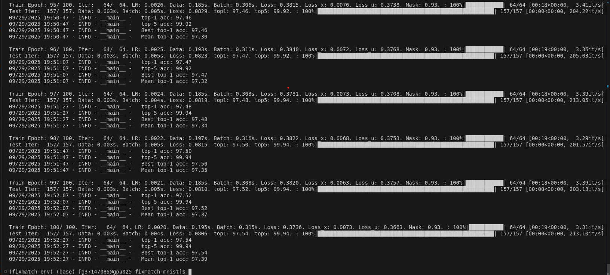

# FixMatch Implementation

This repository contains a modified PyTorch implementation of the [FixMatch](https://arxiv.org/abs/2001.07685) semi-supervised learning algorithm, originally based on the unofficial [FixMatch-PyTorch](https://github.com/kekmodel/FixMatch-pytorch) repository by Jungdae Kim. Most of the code is taken from the original repo. The modifications are mainly related to extend the code to work for MNIST data. Doc strings are added for all the functionalities. Exploring this paper and understanding its implementation(Various SSL techniques and best practices) is necessary for developing the downstream model part of our Capstone project. Check the Readme in `../src` folder for the summary and theoretical concepts of the FixMatch paper.

## Overview

Key functions include main,train, and test (in train.py) for training, get_mnist and get_cifar10 (in dataset/mnist.py) for data loading, build_wideresnet (in models/wideresnet.py) for model creation, and ModelEMA (in models/ema.py) for EMA updates. 

This implementation extends the original FixMatch-PyTorch codebase to include support for the MNIST dataset, which consists of grayscale images. Key modifications include:
- **MNIST Compatibility**: Adjusted data loading and preprocessing to handle single-channel (grayscale) images, including padding from 28x28 to 32x32 to match the actual experiments from the paper.
- **Model Adjustments**: Modified the WideResNet architecture to accept single-channel inputs for MNIST and reduced depth/width for our case (Since MNIST is less complex than CIFAR10 and is resource intensive).
- **Data Augmentation**: Proper handling of color values in Cutout augmentation to use grayscale-compatible values.
- **Code Refinements**: Improved code readability, added detailed documentation, and fixed minor issues for robustness.

The implementation retains full support for CIFAR-10 (But not tested on it, and is out of scope at this stage. It only includes results on MNIST for now) and includes features like Exponential Moving Average (EMA), RandAugment, and distributed training. `Extensive modifications and tuning are required to adapt this code to our capstone project, which will be done in one of our main feature branches (e.g. feature/env)`.

### Directory Structure
```
fixmatch-mnist
├── data/
│   ├── *        # All the data files related to MNIST.
├── dataset/
│   ├── mnist.py        # Dataset loading and preprocessing for MNIST and CIFAR-10
│   ├── randaugment.py  # RandAugment implementation for data augmentation
├── models/
│   ├── ema.py          # Exponential Moving Average implementation
│   ├── wideresnet.py   # WideResNet model architecture
├── results/
│   ├── *        # Checkpoint and Tensorboard Files
├── utils/
│   ├── misc.py         # Helper functions (e.g., accuracy, AverageMeter)
│   ├── __init__.py
├── train.py            # Main training script
├── requirements.txt    # Python dependencies
```

## Setup and Installation

Note: `This code is tested with python 3.10`

To set up the project, follow these steps to clone the repository, create a virtual environment, and install the required dependencies.

1. **Clone the repository** to your local machine:
   ```bash
   git clone https://github.com/phanindra-max/fall-2025-group11.git
   cd fall-2025-group11/src/component/fixmatch-mnist
   ```

2. **Create and activate a virtual environment**:
   ```bash
   # On Windows
   python -m venv fixmatch-env
   .\fixmatch-env\Scripts\activate

   # On macOS/Linux
   python3 -m venv fixmatch-env
   source fixmatch-env/bin/activate
   ```

3. **Install the required dependencies**:
   ```bash
   pip install -r requirements.txt
   ```

## Dataset

- **MNIST**: 60,000 training images and 10,000 test images of handwritten digits (28x28 grayscale, padded to 32x32).
- **CIFAR-10**: 50,000 training images and 10,000 test images of 32x32 RGB images across 10 classes.
- Datasets are automatically downloaded to the `./data` directory on first run.

## Usage

### Training

To train the model on MNIST data, use the `train.py` script with appropriate arguments. Example commands:

#### Train on MNIST
```bash
python train.py --dataset mnist --num-labeled 1000 --arch wideresnet --batch-size 64 --lr 0.01 --expand-labels --seed 5 --out results/mnist@1000.5 --total-steps 6400 --eval-step 64
```

### Key Arguments
- `--dataset`: Choose `mnist` or `cifar10`.
- `--num-labeled`: Number of labeled examples.
- `--batch-size`: Batch size for labeled data (unlabeled batch size is `batch-size * mu` default value for mu is 7).
- `--lr`: Learning rate (default: 0.03).
- `--total-steps`: Total optimization steps (default: 2^20).
- `--eval-step`: Steps between evaluations (default: 1024).
- `--use-ema`: Enable EMA (default: True).
- `--ema-decay`: EMA decay rate (default: 0.999).
- `--out`: Directory for results and checkpoints.
- `--seed`: Random seed for reproducibility (optional).
- `--amp`: Enable mixed-precision training (requires NVIDIA Apex).

## Model Architecture

The implementation uses a WideResNet model with the following modifications:
- **MNIST**: Adjusted input layer for 1-channel (grayscale) images, smaller depth (10) and width (1).
- **CIFAR-10**: Uses WideResNet-28-2 configuration.

## Training Details

- **Loss Function**: Combines supervised cross-entropy loss (labeled data) and unsupervised loss (pseudo-labeled unlabeled data) with a confidence threshold (`--threshold`, default: 0.95).
- **Data Augmentation**: Uses RandAugment for strong augmentation on unlabeled data and weak augmentation (random flip, crop) for labeled data.
- **Optimizer**: SGD with momentum (0.9) and Nesterov acceleration.
- **Learning Rate Schedule**: Cosine decay with optional warmup.
- **Checkpoints**: Saved in `--out` directory, with the best model saved as `model_best.pth.tar`.

Training results are logged to TensorBoard in the `--out` directory. Run below command to monitor the training 
```bash
tensorboard --logdir=<your out_dir> (ex: results/mnist@1000.5)
```
You can also run this command after your training, to check the accuracy and loss curves.


## Results
- To verify the working of this code on MNIST, I trained the wideresnet model for 6400 total steps and 64 eval steps. Other parameters are downscaled as well, as shown in the example training command for quick execution.
- The execution time for this command is around 30 minutes on a `single NVIDIA V100 GPU`.
- The program runs for 100 epochs and the best top-1 accuracy after training is 97.54.
- Below are the training and test accuracy and loss curves from Tensorboard.

`Training curves (Full Loss, Supervised Loss, Unsupervised Loss, Mask Probability ratio)`:


`Test curves (Loss, Accuracy)`:


`Terminal Output`:



## Limitations of FixMatch & Capstone Motivation

FixMatch is a powerful SSL baseline. Understanding the limitations is crucial, as they directly motivate the advanced approach we are developing in our capstone project.

* **Confirmation Bias and Error Propagation:** The core mechanism of pseudo-labeling can lead to confirmation bias. If the model generates an incorrect pseudo-label with high confidence, this error is fed back into the model during subsequent training steps. Over time, the model can become increasingly confident in its own mistakes, causing errors to propagate and hurting performance.

* **Static Confidence Threshold:** FixMatch uses a fixed confidence threshold (e.g., 0.95) to filter pseudo-labels. This "one-size-fits-all" approach is suboptimal, as it doesn't adapt to the model's learning state or the varying difficulty of classes.

* **Augmentation Sensitive:** Performance is highly sensitive to the choice and strength of augmentations. The algorithm's performance is critically dependent on the quality of strong data augmentations. This assumption may not hold for all data domains, where augmentations can alter the semantic meaning of an image.

These challenges not just in FixMatch but in many SSL techniques directly motivate the focus of our capstone project.

Rather than relying on a fixed heuristic like a confidence threshold, our work focuses on developing **adaptive strategies for pseudo-label selection.** The goal is to create a framework that can dynamically assess the reliability of each pseudo-label, learning to trust informative examples while discarding potentially noisy ones. By developing a more intelligent selection process, we aim to build a more robust semi-supervised learning methodology using RL that maximizes the value of unlabeled data while actively mitigating the risks of confirmation bias and error propagation. We will also explore and address other issues in current SSL techniques.

## Acknowledgments

This implementation is a modification of the unofficial [FixMatch-PyTorch](https://github.com/kekmodel/FixMatch-pytorch) repository by Jungdae Kim. Key adaptations were made to support the MNIST dataset and improve code clarity. Please cite the original work:

```
@misc{jd2020fixmatch,
  author = {Jungdae Kim},
  title = {PyTorch implementation of FixMatch},
  year = {2020},
  publisher = {GitHub},
  journal = {GitHub repository},
  howpublished = {\url{https://github.com/kekmodel/FixMatch-pytorch}}
}
```

Additional references:
- Original FixMatch paper: [FixMatch: Simplifying Semi-Supervised Learning with Consistency and Confidence](https://arxiv.org/abs/2001.07685).
- Official TensorFlow implementation: [google-research/fixmatch](https://github.com/google-research/fixmatch).
- RandAugment Implementation: [ildoonet/pytorch-randaugment](https://github.com/ildoonet/pytorch-randaugment)

## Citation

If you find this code or the summary useful in your research, please consider citing the original paper:

```bibtex
@inproceedings{sohn2020fixmatch,
  title={FixMatch: Simplifying Semi-Supervised Learning with Consistency and Confidence},
  author={Sohn, Kihyuk and Berthelot, David and Li, Chun-Liang and Zhang, Zizhao and Carlini, Nicholas and Cubuk, Ekin D and Kurakin, Alex and Zhang, Han and Raffel, Colin},
  booktitle={Advances in Neural Information Processing Systems},
  volume={33},
  pages={596--608},
  year={2020}
}